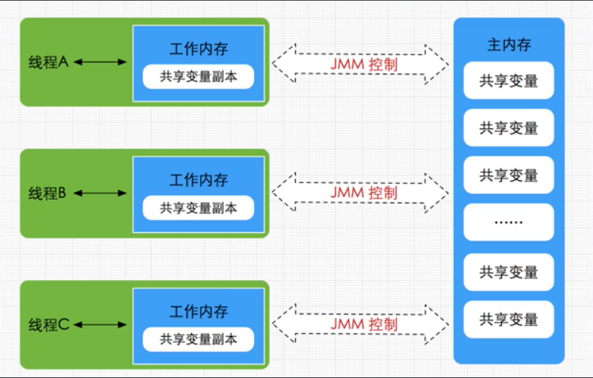
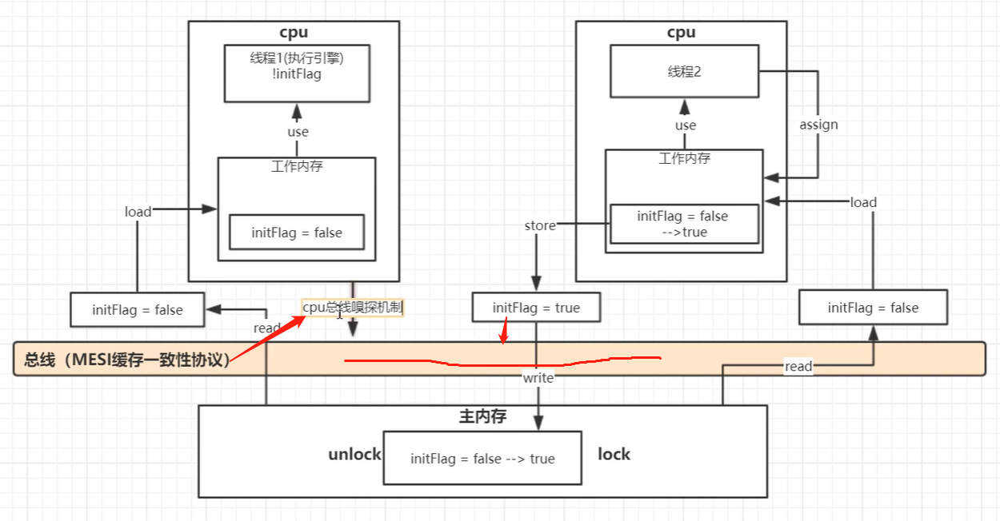

1. 手写一个单例模式（双重检查锁机制）
```java
class Singleton {
    //使用volatile关键字防止重排序，因为 new Instance()是一个非原子操作，可能创建一个不完整的实例
    private static volatile Singleton singleton;
    private Singleton(){}
    public static Singleton getSingleton() {
        // Double-Check idiom
        if (singleton == null) {
            synchronized (Singleton.class) {
                // 只需在第一次创建实例时才同步
                if (singleton == null) {
                    singleton = new Singleton();
                }
            }
        }
        return singleton;
    }
}
```
2. JMM内存模型（java线程内存模型）

    


2. volatile是如何实现变量可见的？用到了哪些指令？工作内存和主内存解决了什么问题？以及他们之间的交互过程

    
    
    并发编程三大特性：
    + 可见性 ：volatile
    + 原子性
    + 有序性
    
（最开始是总线枷锁，访问之间要枷锁，访问完成，释放锁，保证一致）汇编实现的lock指令开启MESI缓存一致性协议以及总线嗅探机制，立马会写的到主内存，store的时候枷锁，回写完成，则unlock。

- read    -从主从中读取数据
- load    -将主存中数据读取到工作内存
- use     -工作内存读取数据来计算
- assign  -将计算好的值重新赋值到工作内存
- store   -将工作内存写入主内存
- write   -将store过去的变量赋值给主内存中的变量
- lock    -主内存变量枷锁，标识为线程独占
- unlock  -将主内存变量解锁，解锁后其他线程可以锁定该变量

java线程并不能直接操作主内存，而是操作工作内存来实现的


3. jvm如何调优？写几个参数出来？尝试设计一个自己的JVM，你会如何设计？

4. dubbo的group怎么用？超时时间设置的作用域有哪些？优先级是什么？

5. ThreadLocal底层如何实现？map中的key是什么？vlaue是什么？需要解决什么问题？哪个方法可以防止内存泄露

6. 讲一下currentHashMap的get方法过程，如何链表转红黑树？

7. 有一个表t1，列为ABC，索引为AC，现在select xx from table where c=xx a =xx有没有用到索引？

8. cas是什么？给你笔画一下具体的实现过程？cas什么时候结束？

9. java的锁存储在哪？占几个比特位？锁是如何升级的？

10. redis的缓存淘汰策略有哪些？LRU和LFU区别，手写一个LRU

11. redis的持久层策略 AOF 和 快照

12. 写出线程池的核心参数，并解释，然后说明线程池是有哪些放弃策略？

12. http属于什么层协议？与https的区别是什么？Tcp协议属于那一层？OSI七层网络模型有哪些？三次握手和四次挥手的过程？为什么握手要三次，挥手要四次？

13. 线上cpu占用率高怎么办？如何排查这个问题，用哪些命令

14. spring使用了哪些设计模式？BeanFactory和Factory的区别是什么？

15. 策略模式的使用场景？说一下它的优点和缺点？

16. 给你一个秒杀场景，如何应对短时间的高峰请求问题？数据库如何防止并发问题？秒杀如何实现不同的客户端的时间一致性？

17. redis的基本数据类型有哪些？hash的使用场景？如何通过redis实现一个阻塞队列？

18. 画出dubbo的调用关系图？并举例说明调用链

19. cas是什么？解释一下cas的原理。并用笔画出来，aba问题怎么解决？

20. 你们的线程池是如何配比的？默认的线程数是多少?写出线程池的几个参数，并结合你们的项目解释一下是如何调优的？

21. sring的事务用过吗？简述一下如何使用？当方法A使用了事务，方法B也使用了事务，他们的事务策略都是:如果没有新的事务就开启一个事务，问调用过程中事务是如何传播的？

22. 给你一串连续的数字，1到10000，随机除去两个数，怎样快速找到这两个数？

23. tomcat的IO框架经历了怎样的变化？谈谈你对NIO流的理解?

24. redis的缓存策略有哪些？手动写一下LRU的实现方法,并介绍一下LFU

25. redis的集群是如何找到具体的key的？你们的集群采用哪种持久化策略？为什么？集群搭建模式是什么？

26. 一串有负数和正数的数字，用算法实现连续的数字加起来的和最大的一串数字？

27. hashmap为什么是线程不安全的？线程安全的有哪些集合？讲一下集合框架，包括map和list

28. 秒杀场景下如何实现分布式锁？redis搭建的集群会存在并发问题吗？怎么解决？

29. 目前jdk用的垃圾回收器是什么？讲一讲垃圾回收的内存划分？引用链可达是从哪里开始回收的？扩展：职责链模式

30. java有哪些加载器？Java的类加载机制是什么？双亲委派机制是什么？有什么好处？我如果想自定义一个名为Object的类，如何加载它？

31. 你知道哪些设计模式？在项目中用到了哪些设计模式？讲一讲具体的应用场景和实现方式

32. redis集群是把数据存储在所有节点吗？如果是存储一个节点？它怎么知道存储到哪个节点？当master节点挂了，缓存是不是就删除了？增加一个节点或者删除一个节点，集群会怎么处理？

33. 方法前如果不声明private、public，那么是什么？它的级别是什么？

34. 有没有线上调优JVM的经验？如何打印gc细节？

35. 把你知道的GC算法都说一下，虚拟机经历了怎样的变化才发展到今天?

36. 你做了什么项目？有哪些功能？有什么优势？解决了什么问题？你认为还有那些优化的点？

37. 什么是可重入锁？假如我一个线程申请了可重入锁，那么子线程可以再次用到可重入锁吗？

38. jvm的内存结构是什么样的？请画出来并且是哪些是线程共享的？哪些是线程私有的？

39. 双向升序链表的插入和删除（笔试）
```java
public class DoubleIcreatLinkList<T> {

    //定义node节点
    class Node<T> {
        //前一个节点指针
        private Node pre;
        //下一个节点指着
        private Node next;
        //数据
        private T data;

        Node(Node pre, Node next, T data) {
            this.pre = pre;
            this.next = next;
            this.data = data;
        }

        public T getData() {
            return data;
        }
    }

    //链表数据数量
    private int size;
    //头节点
    private Node<T> head;


    //初始化构造函数
    public DoubleIcreatLinkList() {
        /**
         * 头结点不存储值 并且头结点初始化时 就一个头结点。
         * 所以头结点的前后节点都是自己
         * 并且这个链表的长度为0；
         */
        head = new Node<>(null, null, null);
        head.pre = head;
        head.next = head;
        size = 0;
    }


    //获取数据量
    public int getSize() {
        return size;
    }

    //判断是为空数组
    public boolean isEmpty() {
        return size == 0;
    }

    //判断索引是否越界
    public void checkIndex(int index) {
        if (index < 0 || index >= size) {
            throw new IndexOutOfBoundsException();
        }
        return;
    }

    //通过索引获取链表中节点
    public Node<T> getNode(int index) {

        /**
         * 检查该索引是否超出范围
         */
        checkIndex(index);

        if (index < size / 2) {  //当索引的值小于该链表长度的一半时，那么从链表的头结点开始向后找是最快的
            Node<T> cur = head.next;
            for (int i = 0; i < index; i++) {
                cur = cur.next;
            }
            return cur;
        } else { // 当索引值位于链表的后半段时，则从链表的另端开始找是最快的
            int newIndex = size - index - 1;
            Node<T> cur = head.pre;
            for (int i = 0; i < newIndex; i++) {
                cur = cur.pre;
            }
            return cur;
        }

    }

    /**
     * 获取节点当中的值
     */
    public T getValue(Node<T> cur) {
        return cur.data;
    }

    /**
     * 获取第一个节点的值
     */
    public T getFirst() {
        return getValue(getNode(0));
    }

    /**
     * 获取最后一个节点的值
     */
    public T getLast() {
        return getValue(getNode(size - 1));
    }


    /**
     * 插入节点
     */
    public Node<T> inesert(int index, T value) {
        checkIndex(index);
        if (index == 0){
            insertToHead(value);
            return getNode(0);
        }else if (index == (size-1)){
            insertTotatil(value);
            return getNode(size-1);
        }else {
            Node<T> node = getNode(index);
            Node<T> newNode = new Node<>(node,node.next,value);
            node.next.pre = newNode;
            node.next = newNode;
            size++;
            return newNode;
        }
    }


    /**
     * 将元素插入链表头部
     */
    public synchronized void insertToHead(T value) {

        //创建这个节点的
        Node<T> cur = new Node<T>(head, head.next, value);
        head.next.pre = cur;
        head.next = cur;
        size++;

    }

    /**
     * 将元素插入到链表的尾部
     */
    public synchronized void insertTotatil(T vlaue) {
        //链表不为空，插入元素
        Node<T> cur = new Node<>(head.pre, head, vlaue);
        head.pre.next = cur;
        head.pre = cur;
        size++;
    }


    /**
     * 删除节点的方法
     */
    public void del(int index) {
        checkIndex(index);
        Node<T> cur = getNode(index);
        //记住此时的指针还没断开 赋值以后才相当于断开
        cur.pre.next = cur.next;
        cur.next.pre = cur.pre;
        size--;
        cur = null;
        return;
    }

    /**
     * 删除第一个节点
     */
    public void delFirst() {
        del(0);
    }

    /**
     * 删除最后一个节点
     */
    public void delLast() {
        del(size - 1);
    }

    Node<T> getHead() {
        return head;
    }


}
```

40. 二维数组的遍历和赋值（笔试）

42. 算法：一个公司找猎头拿简历 1000份，每个猎头需要的佣金一样，但每个猎头拥有的简历数不相同（可能重复） ，问公司如何能雇佣最少的猎头找到更多的简历

42. 接口限流策略有哪些

43. 微服务雪崩后怎么处理的?

44. 多线程环境,线程如何同步？

45. 用多线程统计1到1000000之间有多少个素数，并输出素数（假设cpu有四核）（机试）

46. 用java实现各订单生成器，需要考虑可读、并发、不可重复（机试）

47. 归并排序（机试）

48. rabbitmq消息重复和丢失如何处理?

49. 一个部分有序的数组，如何找到一个指定的数字？要求时间复杂度不能超过log(n)

50. hystrix如何实现服务降级、治理、熔断，讲一讲微服务中服务熔断的过程？你们都是怎么处理的？

51. mysql的limit查询如何进行优化？索引遵循什么原则？

52. ElasticSearch了解吗？ElasticsSearch如何计算评分？评分公式写出来，有哪些查询命令？

53. 微服务的事务你们用什么解决？事务的传播机制，方法A调用方法B，方法A有事务，问调用方法B还会有事务吗？


一. jvm内存布局

+ 程序计数器：当前线程正在执行的字节码的行号指示器，线程私有，唯一一个没有规定任何内存溢出错误的情况的区域。
+ Java虚拟机栈：线程私有，描述Java方法执行的内存模型，每个方法运行时都会创建一个栈帧，存放局部变量表、操作数栈、动态链接、方法出口等信息，每个方法的运行到结束对应一个栈帧的入栈和出栈。会有StackOverFlowError异常（申请的栈深度大于虚拟机所允许深度）和OutOfMemoryError异常（线程无法申请到足够内存）。
+ 本地方法栈：功能与Java虚拟机栈相同，不过是为Native方法服务。
+ java堆：线程共享，存放实例对象和数组对象，申请空间不足抛出OutOfMemoryError异常。
+ 方法区：线程共享，存储已被虚拟机加载的类的类信息、常量、静态变量、编译后的代码；运行时常量池存放class文件中描述的符号引用和直接引用，具有动态性。方法空间不足时抛出OutOfMemoryError异常。
+ 直接内存：JVM规范之外的，NIO类引入了一种基于通道和缓冲区的I/O方式，可使用Native函数库直接分配内存，通过一个存储在Java堆中的DirectByteBuffer对象作为这块内存的引用进行操作，避免了在Java堆和Native堆中来回复制数据。

二.垃圾回收算法与垃圾回收器

+ 垃圾收集算法：

    - 标记-清除算法：将所有需要回收的对象先进行标记，标记结束后对标记的对象进行回收，效率低，会造成大量碎片。
    - 复制算法：将内存分为两块大小相等的空间，每次只用其中一块，若一块内存用完了，就将这块内存中活着的对象复制到另一快内存中，将已使用的进行清除。不会产生碎片，但是会浪费一定的内存空间。堆的年轻代使用此算法，因为年轻代对象多为生存周期比较短的对象。年轻代将空间分为一个Eden和两个survivor，每次只使用Eden加一个survivor，回收时，将Eden和survivor中存活的对象复制到另一个survivor上，最后清理Eden和survivor。当Eden与survivor存活对象大于另一个survivor空间大小则需要老年代来担保。
    - 标记-整理算法：标记阶段与标记-清除算法相同，标记完成后将所有存活对象向一端移动，然后清除掉端边界外对象。
    - 分代收集算法：根据对象存活周期分为将内存分为新生代与老年代，新生代采取复制算法，老年代采用标记清除或标记整理算法。
+ 垃圾回收器：

    - Serial收集器：单线程，垃圾回收时需要停下所有的线程工作。
    - ParNew收集器：Serial的多线程版本。
    - Parallel Scavenge收集器：年轻代，多线程并行收集。设计目标是实现一个可控的吞吐量（cpu运行代码时间/cpu消耗的总时间）。
    - Serial Old收集器：Serial老年代版本。
    - CMS：目标是获得最短回收停顿时间，基于标记清除算法，整个过程四个步骤：初始标记（标记GCRoot直接关联对象，速度很快）、并发标记（从GCRoot向下标记）、重新标记（并发标记过程中发生变化的对象）、并发清除（清除老年代垃圾）。初始标记和重新标记需要停顿所有用户线程。缺点：无法处理浮动垃圾、有空间碎片的产生、对CPU敏感。
+ G1收集器：唯一一个可同时用于老年代与新生代的收集器。采用标记整理算法，将堆分为不同大小星等的Region，G1追踪每个region的垃圾堆积的价值大小，然后有一个优先列表，优先回收价值最大的region，避免在整个堆中进行安全区域的垃圾收集，能建立可预测的停顿时间模型。整个过程四个步骤：初始标记、并发标记、最终标记（并发标记阶段发生变化的对象的变化记录写入线程remembered set log，同时与remembered set合并）、筛选回收（对每个region回收价值和成本拍寻，得到一个最好的回收方案并回收）。

三.垃圾回收对象时程序的逻辑是否可以继续执行

不同回收器不同：Serial、ParNew会暂停用户所有线程工作；CMS、G1会在某一阶段暂停用户线程。

内存分配策略

对象优先在Eden分配：若Eden无空间，Java虚拟机发起一次Minor GC。
大对象直接进入老年代：大对象指需要大量连续内存空间的对象（如长数组、长字符串）
长期存活的对象进入老年代：每个对象有一个对象年龄计数器，age=15晋升为老年代。age+1的两个情况：对象在Eden出生并经过一次Minor GC存活且被survivor容纳；在survivor区经历过一次minor GC。
四.空间分配担保

在Minor GC之前，先检查老年代最大可用连续空间是否大于新生代所有空间总和，成立则此次GC安全
不成立，查看是否允许担保失败设置为true，不允许则进行Full GC
允许，看老年代最大可用连续空间是否大于历次晋升到老年代对象的平均大小，不成立则Full GC
成立，则进行Minor GC
五.Java中的引用

强引用：new这类引用，只要强引用在，对象永远不会被回收。
软引用：描述有用但非必需的对象，在内存溢出之前，会把这些对象列入回收范围内进行第二次垃圾回收。
弱引用：描述非必需对象，只存活到下一次垃圾回收前。
虚引用：不会对生存时间造成影响，不能通过虚引用获得对象实例，只是在被虚引用的对象被回收时受到一个系统通知。
六.简述minor gc和full gc

Minor GC：从新生代回收内存，关键是Eden区内存不足，造成不足的原因是Java对象大部分是朝生夕死(java局部对象)，而死掉的对象就需要在合适的时机被JVM回收
Major GC：从老年代回收内存，一般比Minor GC慢10倍以上。
Full GC：对整个堆来说的，出现Full GC通常伴随至少一次Minor GC，但非绝对。Full GC被触发的时候：老年代内存不足；持久代内存不足；统计得到的Minor GC晋升到老年代平均大小大于老年代空间。
七.java虚拟机new一个对象的创建过程

在常量池中查看是否有new的参数对应的类的符号引用，并检查这个符号引用对应的类是否被加载、解析、初始化
加载后，为新对象分配内存空间，对象多需要的内存大小在类被加载之后就被确定（堆内分配内存：指针碰撞、空闲列表）。
将分配的空间初始化为零值。
对对象头进行必要设置（实例是哪个类的实例、类的元信息数据、GC分代年龄等）。
执行方法，按照程序的值初始化。
八.java中的类加载机制

Java虚拟机中类加载过程：加载、验证、准备、解析、初始化。

加载：通过一个类的全限名来获取定义此类的二进制字节流；将这个字节流代表的静态存储结构转换为方法区的的动态存储结构；在内存中生成一个代表此类的java.lang.Class对象，作为方法区中这个类的访问入口。
验证：验证class文件中的字节流是否符合Java虚拟机规范，包括文件格式、元数据等。
准备：为类变量分配内存并设置类变量初始值，分配内存在方法区。
4.解析：将常量池中符号引用替换为直接引用的过程；符号引用与虚拟机实现的内存布局无关，是使用一组符号来描述所引用的目标。class文件中不会保存各个方法的最终布局信息，所以这些符号引用不经过转化是无法得到真正的内存入口地址；直接引用与虚拟机实现的内存布局有关，可以是直接指向目标的指针，偏移量或指向目标的句柄。此过程主要是静态链接，方法主要为静态方法和私有方法。
5.初始化：真正执行类中定义的Java代码。初始化执行类的方法，该方法由编译器自动收集类中所有类变量的赋值动作和静态语句块的语句合并产生，且保证子类的clinit调用之前会先执行父类的clinit方法，clinit可以不存在（如没有类变量和静态语句块）。
九.双亲委派模型

java中类加载器主要用于实现类的加载，Java中的类和类加载器一起唯一确定类在JVM中的一致性。

系统提供的类加载器：启动类加载器、扩展类加载器、应用程序类加载器。

启动类加载器：用C++实现，是JVM的一部分，其他加载器使用Java实现，独立于JVM。主要负责加载<JAVA_HOME>\lib目录下的类库或被-Xbootclasspath参数指定的路径中的类库，应用程序不能使用该类加载器。
扩展类加载器：负责加载<JAVA_HOME>/lib/ext目录下或者类系统变量java.ext.dirs指定路径下的类库，开发者课直接使用。
应用程序类加载器：主要负责加载classpath下的类库，若应用程序没有自定义类加载器，默认使用此加载器
双亲委派模型要求除了启动类加载器，其他类加载器都有自己的父类加载器，使用组合关系来实现复用父类加载器。过程：若一个类加载器收到类加载请求，会把此请求委派给父类加载器去完成，每层都是如此，因此所有的加载请求最后都会传到启动类加载器；只有当父类加载器反馈不能加载，才会把此请求交给子类完成。

好处：使得java类伴随他的类加载器有了优先级；保证Java程序运行的稳定性

十.简述分派

包括静态分派与动态分派

静态分派：发生在编译时期，所有依赖静态类型来定位方法执行版本的分派称为静态分派，典型应用为方法重载。
动态分派：在运行期根据实际类型确定方法执行版本的分派过程。典型应用为方法重写，实现是在方法去中建立方法表，若子类中没有重写父类方法，则子类虚方法表中该方法的入口地址与父类指向相同，否则子类方法表中地址会替换为指向子类重写的方法的入口地址。
十一.对象的内存布局

对象内存布局分为三部分：对象头、实例数据、对齐填充。

对象头包含两部分：

存储对象自身运行时数据：哈希码、分代年龄、锁状态标志、线程持有的锁、偏向线程ID、偏向时间戳等
对象指向它的类元数据指针–类型指针
实例数据：程序代码中所定义的各种类型的字段内容

对齐填充：不是必然存在，仅起到占位符作用（对象大小必须是8子节整数倍）

十二.虚拟机栈中的各个部分

局部变量表：存放方法参数和方法内部定义的局部变量，以变量槽Slot为基本单位，一个Slot可以存放32位以内的数据类型，可重用。
操作数栈：先入后出，32位数据类型所占栈容量为1，64为数据类型所占栈容量为2
动态链接：常量池中符号引用有一部分在每次运行期间转换为直接引用，这部分称为动态链接。（一部分在类加载阶段或第一次使用时转换为直接引用—静态解析）
方法返回地址：方法执行后退出的两种方式：正常完成出口（执行引擎遇到任意一个返回的字节码指令）和异常完成出口（在方法执行过程中遇到异常且此异常未被处理）。两种方式都需要返回到方法被调用的位置程序才能继续执行（正常退出时调用者的PC计数器的值可以作为返回地址且栈帧中很可能保存这个计数器值；异常退出返回地址要通过异常处理器表来确定，栈帧中一般不会保存）。
十三.Java内存模型的happen before原则

如果两个操作存在happens-before关系，那么前一个操作的结果就会对后面一个操作可见，是定义的两个操作之间的偏序关系，常见的规则：

程序顺序规则：一个线程中每个操作，happens-before于该线程中的任意后续操作
监视器锁规则：对一个锁的解锁，happens-before于随后这个锁的加锁
volatile变量规则：对一个volatile域的写，happens-before于任意后续对这个域的读
传递性：若A happens-before B，B happens-before C，则A happens-before C
start()规则：如果线程A执行ThreadB.start()，那么A线程的ThreadB.start()操作happens-before于线程B中的任意操作。
join()规则：若线程A 执行ThreadB.join()并成功返回，则线程B的任意操作happens-before于线程A从ThreadB.jion()操作返回成功。
十四.java中方法区存放哪些东西？jvm如何控制方法区的大小以及内存溢出的原因和解决

方法区大小不是固定的，jvm可根据需要动态调整。方法区主要存放类信息、常量、静态变量、编译后的代码。

控制方法区大小：减少程序中class数量、尽量使用较少的静态变量

修改：-XX:MaxPerSize调大

StackOverflowError异常：线程的方法嵌套调用层次太多，随着Java栈中桢的增多，最终会由于该线程Java栈中所有栈帧总和大于-Xss设置的值而产生此异常。

十五.jvm OutMemory的种类

堆溢出：被缓存的实例对象，大的map，list引用大的对象等
栈溢出：栈帧太多
方法区溢出：加载很多类会有可能出现，GC不会在主程序运行期对此区域进行清理，可通过设置jvm启动参数解决：-XX:MaxPermSize=256m
十六.jvm如何判断对象是否失效？可达性分析是否可以解决循环引用

引用计数器算法：给对象添加一个引用计数器，当被引用时给计数器加1，引用失效减1，当为0时对象失效。实现简单，判定效率高，无法解决循环引用问题。
可达性分析算法：将一系列GC Root作为起始点，从这些节点开始向下搜索，所走过路径称为引用链，若一个对象无引用链，则判断是否执行finalize()方法，若finalize()被覆盖并且没被JVM调用过，则执行此方法，执行后若还无引用链，则对象失效。
可以作为GC Root的对象：

虚拟机栈中引用的对象
方法区中类静态属性引用的对象
方法区中常量引用的对象
本地方法栈中Native方法引用的对象
除了了解以上的16到JVM面试题，我们还需要掌握JVM的相关技术点。

现在互联网公司面试的时候都会问到JVM，但是仅仅掌握JVM是不够的，我们需要掌握更多的基础知识，这是我整理的一些需要掌握的知识技术点，分享给大家：

需要思维导图格式的可以私信我“架构”

架构师筑基知识点

1.1 JVM性能调优

- 性能优化如何理解
- JVM内存管理机制
- JVM执行子系统
- 程序编译与代码优化
- 实战调优案例与解决方法

1.2. Java程序性能优化

- 优雅的创建对象
- 注意对象的通用方法
- 类的设计陷阱
- 泛型需要注意的问题
- Java方法的那些坑
- 程序设计的通用规则
    
1.3 Tomcat

- Tomcat线程模型分析
- Tomcat生产环境配置
- Tomcat运行机制及框架
- Tomcat针对并发优化
- Tomcat针对内存优化
- 手写Tomcat实战

1.4 并发编程进阶

- 线程基础
- 原子操作类和CAS
- Lock、Condition和显示锁
- AbstractQueuedSynchronizer分析
- 并发工具类和并发容器
- 线程池和Executor框架
- 实现原理和Java内存模型
- 线程安全
- 并发项目实战

1.5. Mysql

- 探析BTree机制
- 执行计划深入分析
- Mysql索引优化详解
- 慢查询分析与SQL优化

1.6. 高性能Netty框架

- Netty简介
- I/O 演进之路及NIO 入门
- Netty 开发环境搭建安装
- TCP 粘包/拆包问题的解决之道
- 分隔符和定长解码器的应用
- Netty 多协议开发和应用
- WebSocket 协议开发
- Netty源码分析

1.7. Linux基础与进阶

- Linux入门安装
- Linux注意事项
- Linux基础指令
- Linux Jdk1.8环境安装及操作指令
- Linux Tomcat安装与停启
- Linux下Docker进阶讲解
- Linux下Docker与Tomcat集成实战


1.框架ssm
2.集合相关的map,list相关的
3.多线程相关的工作中怎么用的
4.java锁
5.缓存
6.异步消息队列
7.微服务（重点基本面试都要求会这个）
8.数据库相关的优化